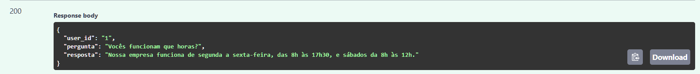
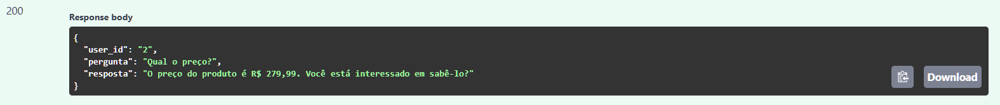
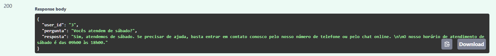
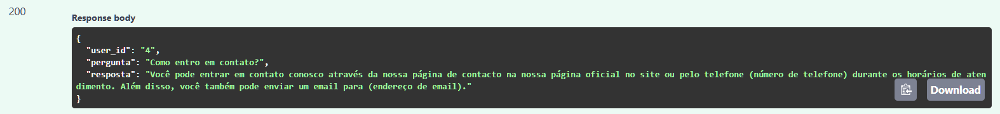

# 🤖 Chatbot API com Inteligência Artificial

📌 API de chatbot com respostas inteligentes, pronta para integração com sistemas reais.

💡 Ideal para automação de atendimento, SAC inteligente e assistentes virtuais.

Este projeto foi desenvolvido com o objetivo de simular um atendimento automatizado utilizando Inteligência Artificial.

A ideia é simples: criar um sistema capaz de responder perguntas de forma natural, como um atendente real faria, ajudando empresas a economizar tempo e melhorar a experiência do cliente.

O chatbot foi construído com FastAPI e integrado a uma API de IA, permitindo respostas dinâmicas e adaptáveis a diferentes contextos de atendimento.

## Sobre o projeto

Este projeto nasceu com foco em prática e aplicação real.

A proposta foi desenvolver um chatbot funcional, com uma estrutura organizada de backend e integração com IA, simulando um cenário que pode ser facilmente adaptado para empresas reais.

Além disso, o sistema foi pensado para evoluir, podendo futuramente ser integrado com WhatsApp, Instagram ou outros canais de atendimento.

---

## Preview do sistema

### 📌 Documentação da API

<p align="center">
  
</p>

---

### 🤖 Atendimento automatizado com IA

<p align="center">
  
</p>

<p align="center">
  
</p>

<p align="center">
  
</p>

<p align="center">
  
</p>

---

## Tecnologias utilizadas

- Python
- FastAPI
- Uvicorn
- Integração com IA (Groq API)
- Pydantic

---

## Como rodar o projeto

```bash
# Clonar o repositório
git clone <seu-repositorio>

# Entrar na pasta
cd chatbot

# Criar ambiente virtual
python -m venv .venv

# Ativar (Windows)
.venv\Scripts\activate

# Instalar dependências
pip install -r requirements.txt

# Rodar o servidor
uvicorn main:app --reload
```

## Acessar a API

Após rodar o projeto, acesse:

👉 http://127.0.0.1:8000/docs

## Exemplo de uso

### Entrada

```json
{
  "user_id": "1",
  "text": "Vocês funcionam que horas?"
}
```

---

### Saída

```json
{
  "user_id": "1",
  "pergunta": "Vocês funcionam que horas?",
  "resposta": "Nossa empresa funciona de segunda a sexta..."
}
```

---

## Possíveis aplicações

- Atendimento automatizado ao cliente
- Chatbots comerciais
- Integração com WhatsApp
- Assistentes virtuais personalizados

---


Projeto desenvolvido com foco em aprendizado prático e construção de soluções reais, com potencial de aplicação em cenários comerciais.