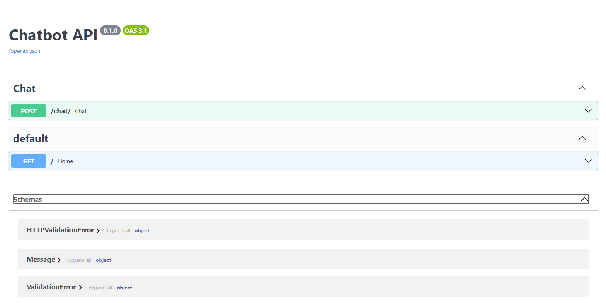

# 🤖 Chatbot API com Inteligência Artificial


📌 API de atendimento automatizado com IA, desenvolvida em FastAPI, com arquitetura organizada e pronta para integração com sistemas reais.

💡 Ideal para automação de atendimento, SAC inteligente e construção de assistentes virtuais.

---

## 🚀 Sobre o projeto

Este projeto foi desenvolvido com foco em prática real de backend, simulando um sistema de atendimento automatizado baseado em Inteligência Artificial.

A API recebe mensagens de usuários, processa o contexto e retorna respostas inteligentes, com comportamento semelhante a um atendente humano.

A arquitetura foi pensada para ser limpa, escalável e fácil de manter, seguindo uma separação clara de responsabilidades entre rotas, serviços e modelos de dados.

---

## 🧠 Diferenciais

- Arquitetura organizada (routes, services, schemas)
- Integração com IA (Groq API)
- Engenharia de prompt para respostas mais naturais
- Código modular e fácil de evoluir
- Estrutura pronta para expansão (memória, integrações, etc)

---

## 📁 Estrutura do projeto

```bash
```bash
chatbot-api-fastapi/
├── schemas/
├── routes/
├── services/
├── docs/
│   └── images/
├── main.py
└── requirements.txt
```

---

## Tecnologias utilizadas

- Python
- FastAPI
- Uvicorn
- Integração com IA (Groq API)
- Pydantic

---

## Preview do sistema

### 📌 Documentação da API

  <p align="center">  </p>

---

### 🤖 Atendimento automatizado com IA

<p align="center">  </p> 
<p align="center">  </p> 
<p align="center">  </p> 
<p align="center">  </p>

---

## ⚙️ Como rodar o projeto

```bash
# Clonar o repositório
git clone <seu-repositorio>

# Entrar na pasta
cd chatbot

# Criar ambiente virtual
python -m venv .venv

# Ativar (Windows)
.venv\Scripts\activate

# Instalar dependências
pip install -r requirements.txt

# Rodar o servidor
uvicorn main:app --reload
```

---

## 🔐 Configuração do ambiente

Crie um arquivo `.env` na raiz do projeto com:

GROQ_API_KEY=sua_chave_aqui

---

## 🌐 Acessar a API

Após rodar o projeto, acesse:

👉 http://127.0.0.1:8000/docs

Interface interativa para testar as rotas da API (Swagger UI).

---

## 📌 Exemplo de uso

### Entrada

```json
{
  "user_id": "1",
  "text": "Qual é o preço?"
}
```

---

### Saída

```json
{
  "user_id": "1",
  "pergunta": "Qual é o preço?",
  "resposta": "Os preços variam conforme o serviço. Pode me informar qual solução você procura?"
}
```

---

## 🎯 Aplicações

- Atendimento automatizado via API
- Chatbots comerciais
- Assistentes virtuais
- Backend para sistemas com IA
- Base para integração com diferentes canais

---

## 📈 Possíveis evoluções

- Memória por usuário (contexto de conversa)
- Integração com frontend (React, Web, Mobile)
- Integração com canais externos (WhatsApp, Telegram, etc)
- Banco de dados para histórico de atendimento
- Sistema de respostas híbridas (FAQ + IA)

--

👨‍💻 Autor

Desenvolvido por Fernando Almeida
GitHub: https://github.com/nandoalmeidam